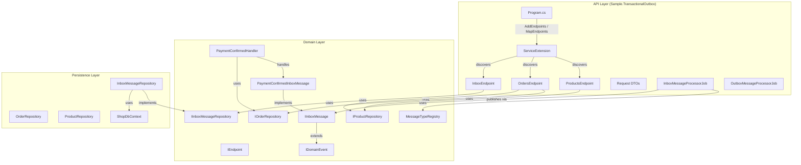
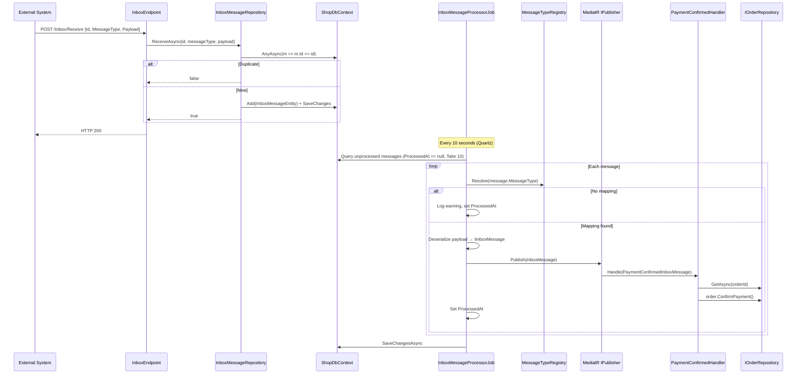

# Design Document: Endpoint Restructure and Generic Inbox

## Overview

This design restructures the application in two complementary areas:

1. **Endpoint reorganization** — Inline Minimal API definitions in `Program.cs` are extracted into dedicated `IEndpoint` classes (`ProductsEndpoint`, `OrdersEndpoint`, `InboxEndpoint`), discovered and registered automatically via assembly scanning. `Program.cs` becomes a clean composition root.

2. **Generic inbox processing** — The `InboxMessageProcessorJob` is decoupled from specific message types. Instead of a hardcoded `switch`, it uses a `MessageTypeRegistry` to resolve CLR types and MediatR `IPublisher` to dispatch deserialized `IInboxMessage` notifications to their handlers. This mirrors the existing `OutboxMessageProcessorJob` pattern.

No new NuGet packages are required. The feature uses MediatR 12.5.0 (Apache-2.0), Newtonsoft.Json 13.0.4, EF Core, and Quartz.NET — all already present in the solution.

## Architecture

The layered architecture (API → Persistence → Domain) is preserved. New components are placed according to existing conventions.



### Key Design Decisions

1. **IEndpoint in the API project, not Domain** — The `IEndpoint` interface depends on `IEndpointRouteBuilder` (ASP.NET Core), which belongs in the API layer. Placing it in Domain would introduce an infrastructure dependency. Since all endpoint classes live in the API project, the interface lives there too.

2. **MessageTypeRegistry as a simple Dictionary wrapper** — A `Dictionary<string, Type>` is sufficient. No reflection-based auto-discovery of message types is needed because explicit registration makes the mapping visible and debuggable. The registry is registered as a singleton.

3. **IInboxMessage extends INotification (not IDomainEvent)** — Inbox messages are external notifications, not domain events raised by aggregates. A separate `IInboxMessage : INotification` interface in the Domain layer keeps the semantic distinction clear while still leveraging MediatR's dispatch.

4. **IInboxMessageRepository in Domain, implementation in Persistence** — Follows the existing pattern where `IOrderRepository` and `IProductRepository` are in Domain and their implementations are `internal` classes in Persistence. The inbox receive logic (idempotency check + persist) is encapsulated here.

5. **DTO records in a dedicated file** — `CreateOrderRequest` and `InboxReceiveRequest` are moved from `Program.cs` to a `Contracts/` folder in the API project, keeping them accessible to endpoint classes.

## Components and Interfaces

### 1. IEndpoint Interface

**Location:** `Sample.TransactionalOutbox/Endpoints/IEndpoint.cs`

```csharp
namespace Sample.TransactionalOutbox.Endpoints;

public interface IEndpoint
{
    void MapEndpoint(IEndpointRouteBuilder app);
}
```

### 2. ServiceExtension (Endpoint Discovery)

**Location:** `Sample.TransactionalOutbox/Endpoints/ServiceExtension.cs`

Provides two extension methods:

```csharp
namespace Sample.TransactionalOutbox.Endpoints;

public static class ServiceExtension
{
    // Scans the given assembly for IEndpoint implementations and registers them in DI
    public static IServiceCollection AddEndpoints(this IServiceCollection services, Assembly assembly);

    // Resolves all IEndpoint instances and calls MapEndpoint on each
    public static WebApplication MapEndpoints(this WebApplication app);
}
```

**AddEndpoints** uses `assembly.GetTypes()` to find all non-abstract classes implementing `IEndpoint`, then registers each as transient. **MapEndpoints** creates a scope, resolves `IEnumerable<IEndpoint>`, and calls `MapEndpoint` on each.

### 3. ProductsEndpoint

**Location:** `Sample.TransactionalOutbox/Endpoints/ProductsEndpoint.cs`

Implements `IEndpoint`. Registers:
- `GET /Products` — returns all products via `IProductRepository`
- `GET /Products/{id}` — returns a single product, 404 on not found

Uses `app.MapGroup("/Products").WithTags("Products")` to group routes. Preserves all existing Swagger metadata.

### 4. OrdersEndpoint

**Location:** `Sample.TransactionalOutbox/Endpoints/OrdersEndpoint.cs`

Implements `IEndpoint`. Registers:
- `GET /Orders` — returns all orders via `IOrderRepository`
- `POST /Orders` — creates a new order (validates product exists)
- `POST /PurchaseOrder/{id}` — confirms an order (note: this route is at root level, not under `/Orders` group, to preserve the existing URL)
- `POST /Orders/{id}/Cancel` — cancels an order

Uses `app.MapGroup("/Orders").WithTags("Orders")` for the `/Orders` routes. The `/PurchaseOrder/{id}` route is mapped directly on `app` since it doesn't share the `/Orders` prefix. Preserves all existing HTTP status codes, ProblemDetails responses, and Swagger metadata.

### 5. InboxEndpoint

**Location:** `Sample.TransactionalOutbox/Endpoints/InboxEndpoint.cs`

Implements `IEndpoint`. Registers:
- `POST /Inbox/Receive` — delegates to `IInboxMessageRepository`

The endpoint is a thin wrapper: it calls the repository's receive method and returns HTTP 200 regardless of whether the message was new or duplicate. No direct `ShopDbContext` access.

### 6. IInboxMessageRepository / InboxMessageRepository

**Domain interface:** `Sample.TransactionalOutbox.Domain/Inbox/IInboxMessageRepository.cs`

```csharp
namespace Sample.TransactionalOutbox.Domain.Inbox;

public interface IInboxMessageRepository
{
    /// <summary>
    /// Receives an inbox message. Returns true if the message was persisted (new),
    /// false if it was a duplicate.
    /// </summary>
    Task<bool> ReceiveAsync(Guid id, string messageType, string payload, CancellationToken cancellationToken);
}
```

**Persistence implementation:** `Sample.TransactionalOutbox.Persistence/Repository/InboxMessageRepository.cs`

```csharp
internal class InboxMessageRepository : IInboxMessageRepository
{
    // Checks for existing message by Id (AsNoTracking).
    // If duplicate, returns false.
    // If new, creates InboxMessageEntity with ReceivedAt = DateTime.UtcNow, persists, returns true.
}
```

Registered in `ServicesExtensions.AddPersistence()` as transient, consistent with existing repositories.

### 7. IInboxMessage Interface

**Location:** `Sample.TransactionalOutbox.Domain/Primitives/IInboxMessage.cs`

```csharp
using MediatR;

namespace Sample.TransactionalOutbox.Domain.Primitives;

public interface IInboxMessage : INotification { }
```

Placed alongside `IDomainEvent` in the Primitives folder.

### 8. MessageTypeRegistry

**Location:** `Sample.TransactionalOutbox.Domain/Inbox/MessageTypeRegistry.cs`

```csharp
namespace Sample.TransactionalOutbox.Domain.Inbox;

public class MessageTypeRegistry
{
    private readonly Dictionary<string, Type> _mappings = new();

    public MessageTypeRegistry Register<T>(string messageType) where T : IInboxMessage
    {
        _mappings[messageType] = typeof(T);
        return this;
    }

    public Type? Resolve(string messageType)
    {
        _mappings.TryGetValue(messageType, out var type);
        return type;
    }
}
```

Registered as a singleton in `Program.cs` with explicit mappings:

```csharp
var registry = new MessageTypeRegistry();
registry.Register<PaymentConfirmedInboxMessage>("PaymentConfirmed");
builder.Services.AddSingleton(registry);
```

### 9. PaymentConfirmedInboxMessage

**Location:** `Sample.TransactionalOutbox.Domain/Inbox/PaymentConfirmedInboxMessage.cs`

```csharp
namespace Sample.TransactionalOutbox.Domain.Inbox;

public sealed record PaymentConfirmedInboxMessage(Guid OrderId) : IInboxMessage;
```

### 10. PaymentConfirmedHandler

**Location:** `Sample.TransactionalOutbox.Domain/Inbox/Handlers/PaymentConfirmedHandler.cs`

```csharp
namespace Sample.TransactionalOutbox.Domain.Inbox.Handlers;

internal sealed class PaymentConfirmedHandler : INotificationHandler<PaymentConfirmedInboxMessage>
{
    // Injected: IOrderRepository, ILogger<PaymentConfirmedHandler>
    // 1. Validates payload (throws InvalidOperationException if OrderId is empty)
    // 2. Looks up order via IOrderRepository
    // 3. Calls order.ConfirmPayment()
}
```

Follows the existing `internal sealed` convention for handlers (same as `OrderConfirmedEventHandler`).

### 11. Refactored InboxMessageProcessorJob

**Location:** `Sample.TransactionalOutbox/Job/InboxMessageProcessorJob.cs` (modified in place)

Dependencies change from `(ILogger, ShopDbContext, IOrderRepository)` to `(ILogger, ShopDbContext, IPublisher, MessageTypeRegistry)`.

Processing loop per message:
1. Skip if `ProcessedAt` is already set (idempotency)
2. Resolve CLR type via `MessageTypeRegistry.Resolve(message.MessageType)`
3. If no mapping → log warning, set `ProcessedAt`, continue
4. Deserialize `message.Payload` into the resolved type using `Newtonsoft.Json`
5. Publish via `IPublisher.Publish()`
6. Set `ProcessedAt` on success
7. On exception: set `Error` and `ProcessedAt`

### 12. Request DTOs

**Location:** `Sample.TransactionalOutbox/Contracts/CreateOrderRequest.cs` and `InboxReceiveRequest.cs`

```csharp
namespace Sample.TransactionalOutbox.Contracts;

public record CreateOrderRequest(Guid ProductId, int Quantity, decimal TotalAmount, string CustomerName, string? ShippingAddress = null);

public record InboxReceiveRequest(Guid Id, string MessageType, string Payload);
```

### 13. Program.cs (Cleaned Up)

After restructuring, `Program.cs` contains only:
- Service registrations (`AddPersistence`, `AddMediatR`, `AddQuartz`, `AddEndpoints`)
- `MessageTypeRegistry` setup
- Middleware pipeline (`MapOpenApi`, `UseSwagger`, etc.)
- `app.MapEndpoints()`
- `SeedDb.Initialize`
- No inline endpoint definitions

## Data Models

### Existing Entities (Unchanged)

| Entity | Table | Key Fields |
|---|---|---|
| `InboxMessageEntity` | `InboxMessages` | `Id`, `MessageType`, `Payload`, `ReceivedAt`, `ProcessedAt`, `Error` |
| `OutboxMessageEntity` | `DomainEvents` | `Id`, `Type`, `Content`, `CreationTime`, `CompleteTime`, `Exception` |
| `OrderEntity` | `Orders` | `Id`, `ProductId`, `Quantity`, `TotalAmount`, `OrderStatus`, ... |
| `ProductEntity` | `Products` | `Id`, `Name`, `Price`, `Sku`, `Quantity`, ... |

No schema changes are required. The `InboxMessageEntity` already has all the fields needed for the generic processing flow.

### New Domain Types (Not Persisted)

| Type | Purpose |
|---|---|
| `IInboxMessage` | Marker interface extending `INotification` for inbox messages |
| `PaymentConfirmedInboxMessage` | Record carrying `OrderId`, deserialized from inbox payload |
| `MessageTypeRegistry` | In-memory dictionary mapping `MessageType` strings to CLR types |

### Data Flow: Inbox Message Lifecycle




## Correctness Properties

*A property is a characteristic or behavior that should hold true across all valid executions of a system — essentially, a formal statement about what the system should do. Properties serve as the bridge between human-readable specifications and machine-verifiable correctness guarantees.*

### Property 1: Inbox message persistence round-trip

*For any* valid (id, messageType, payload) tuple where the id does not already exist, calling `ReceiveAsync` and then reading the entity back from the database should yield an `InboxMessageEntity` whose `Id`, `MessageType`, and `Payload` fields match the input, and whose `ReceivedAt` is set to a non-default value.

**Validates: Requirements 4.4**

### Property 2: Inbox message receive idempotency

*For any* valid (id, messageType, payload) tuple, calling `ReceiveAsync` twice with the same `id` should return `true` on the first call and `false` on the second call, and the database should contain exactly one `InboxMessageEntity` with that `id`.

**Validates: Requirements 4.3**

### Property 3: MessageTypeRegistry register-then-resolve round-trip

*For any* (messageType string, CLR type implementing IInboxMessage) pair, after registering the pair in the `MessageTypeRegistry`, calling `Resolve` with that messageType string should return the exact CLR type that was registered.

**Validates: Requirements 9.1, 9.2**

### Property 4: MessageTypeRegistry returns null for unregistered keys

*For any* string that has not been registered in the `MessageTypeRegistry`, calling `Resolve` should return `null`.

**Validates: Requirements 9.3**

### Property 5: Inbox message deserialization round-trip

*For any* valid `IInboxMessage` instance (e.g., `PaymentConfirmedInboxMessage` with a random non-empty `OrderId`), serializing it to JSON and storing it as the `Payload` of an `InboxMessageEntity` with the corresponding `MessageType`, then running the `InboxMessageProcessorJob`, should result in MediatR publishing a message equal to the original instance.

**Validates: Requirements 10.2**

### Property 6: InboxMessageProcessorJob error handling preserves error details

*For any* `InboxMessageEntity` whose processing throws an exception (e.g., invalid payload for a registered type), after the job executes, the entity's `Error` field should contain the exception message and `ProcessedAt` should be set to a non-null value.

**Validates: Requirements 10.7**

### Property 7: InboxMessageProcessorJob skips already-processed messages

*For any* `InboxMessageEntity` where `ProcessedAt` is already set to a non-null value, running the `InboxMessageProcessorJob` should not invoke MediatR `Publish` for that message, and the entity's `Error` and `ProcessedAt` fields should remain unchanged.

**Validates: Requirements 10.8**

## Error Handling

### Endpoint Layer

| Scenario | Response |
|---|---|
| Product not found by ID | HTTP 404 with `ProblemDetails` (title: "Product not found") |
| Order not found by ID | HTTP 404 with `ProblemDetails` (title: "Order not found") |
| Order not in Pending status (confirm/cancel) | HTTP 409 with `ProblemDetails` (title: "Conflict") |
| Invalid request body (model binding failure) | HTTP 400 (ASP.NET Core automatic validation) |
| Inbox receive with duplicate ID | HTTP 200 (idempotent, no error) |

All error responses preserve the existing behavior from the current inline endpoints.

### InboxMessageProcessorJob

| Scenario | Behavior |
|---|---|
| `MessageType` has no registry mapping | Log warning, set `ProcessedAt`, continue to next message |
| Deserialization fails (invalid JSON / type mismatch) | Catch exception, set `Error` to exception message, set `ProcessedAt` |
| Handler throws (e.g., order not found, invalid state) | Catch exception, set `Error` to exception message, set `ProcessedAt` |
| No unprocessed messages in batch | Return immediately, no DB write |

The job always calls `SaveChangesAsync` at the end of the batch to persist all `ProcessedAt` and `Error` updates in a single round-trip, consistent with the current implementation.

### PaymentConfirmedHandler

| Scenario | Behavior |
|---|---|
| `OrderId` is `Guid.Empty` | Throws `InvalidOperationException` (caught by job's error handling) |
| Order not found by `OrderId` | `IOrderRepository.GetAsync` throws `InvalidOperationException` (caught by job) |
| Order not in Pending status | `order.ConfirmPayment()` throws `InvalidOperationException` (caught by job) |

The handler does not catch exceptions itself — it lets them propagate to the job, which records them in the `Error` field.

### InboxMessageRepository

| Scenario | Behavior |
|---|---|
| Duplicate message ID | Returns `false`, no exception, no new record |
| Database error during save | Exception propagates to caller (endpoint returns 500 via ASP.NET Core default handler) |

## Testing Strategy

### Approach

The project currently has no test project. A new `Sample.TransactionalOutbox.Tests` xUnit project will be added to the solution.

**Dual testing approach:**
- **Unit tests** — Verify specific examples, edge cases, and error conditions using mocks where appropriate
- **Property-based tests** — Verify universal properties (Properties 1–7) across many generated inputs

### Property-Based Testing Library

**Library:** [FsCheck.Xunit](https://github.com/fscheck/FsCheck) (BSD-3-Clause license)
- Mature .NET PBT library with xUnit integration
- Supports custom generators via `Arb<T>`
- Each property test configured for minimum 100 iterations

**Tag format:** Each property test will include a comment referencing the design property:
```
// Feature: endpoint-restructure-and-generic-inbox, Property {N}: {title}
```

### Test Categories

#### Property-Based Tests (7 properties)

| Property | Component Under Test | Generator Strategy |
|---|---|---|
| P1: Persistence round-trip | `InboxMessageRepository` | Random Guid, random non-empty strings for messageType/payload |
| P2: Receive idempotency | `InboxMessageRepository` | Random Guid, random non-empty strings |
| P3: Registry round-trip | `MessageTypeRegistry` | Random non-empty strings mapped to a fixed set of IInboxMessage types |
| P4: Unregistered returns null | `MessageTypeRegistry` | Random strings not in the registered set |
| P5: Deserialization round-trip | `InboxMessageProcessorJob` | Random `PaymentConfirmedInboxMessage` (random non-empty Guid) |
| P6: Error handling | `InboxMessageProcessorJob` | Random invalid payloads for registered message types |
| P7: Skip processed | `InboxMessageProcessorJob` | Random messages with `ProcessedAt` already set |

#### Unit Tests (Example-Based)

| Test | What It Verifies |
|---|---|
| Unknown MessageType handling | Job logs warning, sets ProcessedAt (Req 10.4) |
| Batch limit of 10 | Job processes at most 10 messages per execution (Req 10.9) |
| PaymentConfirmedHandler with empty OrderId | Throws InvalidOperationException (Req 11.4) |
| InboxEndpoint returns 200 for new message | Endpoint delegates to repository, returns 200 (Req 5.6) |
| InboxEndpoint returns 200 for duplicate | Endpoint delegates to repository, returns 200 (Req 5.5) |

#### Integration Tests

| Test | What It Verifies |
|---|---|
| All endpoints registered | WebApplicationFactory verifies all routes exist (Req 6.1–6.3) |
| Products GET routes | Correct data returned (Req 2.2, 2.3) |
| Orders CRUD routes | Create, confirm, cancel work end-to-end (Req 3.2–3.5) |
| Inbox receive end-to-end | POST /Inbox/Receive persists message (Req 5.2) |
| Full inbox processing pipeline | Receive → Job processes → Handler confirms order (Req 10.1–10.3, 11.2–11.3) |

### Test Infrastructure

- **In-memory EF Core** for repository and job tests (same provider as production)
- **Mock `IPublisher`** for verifying MediatR publish calls in job tests
- **`WebApplicationFactory<Program>`** for integration tests
- **FsCheck custom `Arbitrary<T>`** generators for domain types
