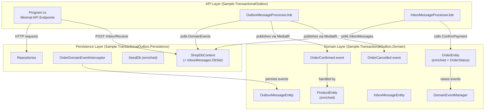
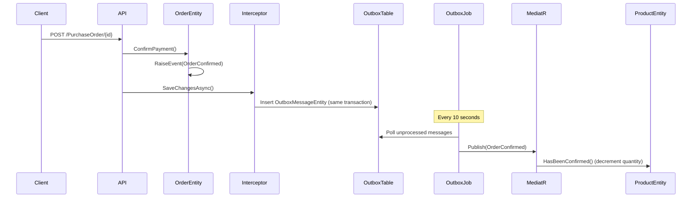
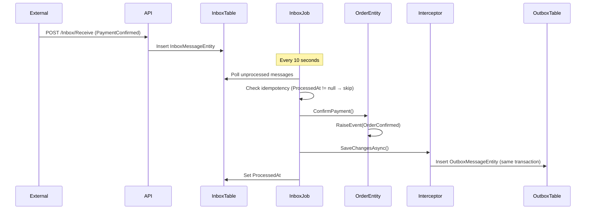
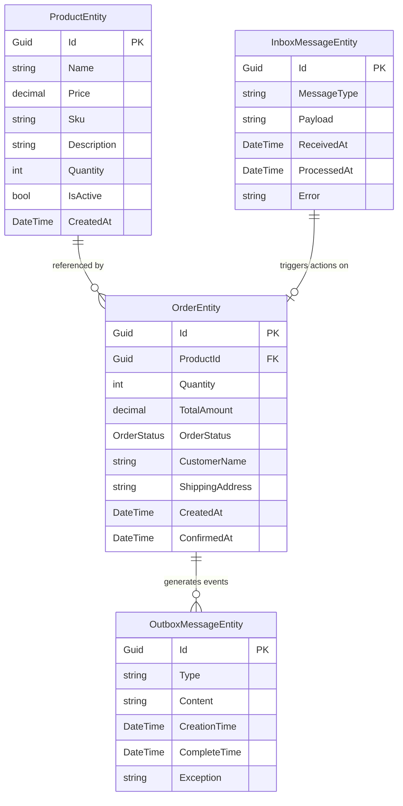

# Design Document: Marketplace Enrich and Inbox

## Overview

This design enriches the existing `Sample.TransactionalOutbox` project from a minimal outbox-pattern demo into a realistic marketplace "Orders" microservice. The changes span three areas:

1. **Richer domain entities** — `ProductEntity` gains catalog properties (name, price, SKU, description, active status) and `OrderEntity` gains marketplace order properties (quantity, total amount, status enum, customer info, timestamps) with a proper order lifecycle (Pending → Confirmed / Cancelled).
2. **Transactional Inbox pattern** — A new `InboxMessageEntity` and `InboxMessageProcessorJob` complement the existing outbox, demonstrating how to reliably receive and idempotently process external messages (e.g., `PaymentConfirmed`).
3. **API, seed data, and documentation** — New endpoints (`POST /Orders/{id}/Cancel`, `GET /Products/{id}`, `POST /Inbox/Receive`), realistic seed data, full Swagger annotations, an updated `.http` file, and comprehensive documentation covering both patterns.

The design preserves all existing conventions: private constructors with static `Create` factory methods, domain events as record classes implementing `IDomainEvent`, `internal sealed` event handlers, Quartz.NET background jobs with `[DisallowConcurrentExecution]`, Newtonsoft.Json with `TypeNameHandling` for polymorphic serialization, and EF Core InMemory provider.

## Architecture

The existing three-layer architecture is preserved. New components are added within each layer following established conventions.



### Message Flow: Outbox (Events Going Out)



### Message Flow: Inbox (Messages Coming In)



## Components and Interfaces

### Domain Layer Changes

#### ProductEntity (Enriched)

The existing `ProductEntity` is extended with catalog properties. The `Create` factory method signature changes to accept `name`, `price`, `sku`, and `quantity`. Validation is added for `name` (non-empty), `price` (positive), and `sku` (non-empty). The existing `Id`, `Quantity`, and `HasBeenConfirmed()` are retained.

```csharp
public class ProductEntity
{
    // Existing
    public Guid Id { get; private set; }
    public int Quantity { get; private set; }

    // New
    public string Name { get; private set; }
    public decimal Price { get; private set; }
    public string Sku { get; private set; }
    public string? Description { get; private set; }
    public bool IsActive { get; private set; }
    public DateTime CreatedAt { get; private set; }

    public static ProductEntity Create(string name, decimal price, string sku, int quantity, string? description = null);
    public void HasBeenConfirmed(); // existing behavior preserved
}
```

#### OrderEntity (Enriched)

The existing `OrderEntity` replaces `bool Confirmed` with an `OrderStatus` enum and `string Description` with marketplace properties. A new `CancelOrder()` method is added alongside the existing `ConfirmPayment()`. Both methods enforce that the order must be in `Pending` status.

```csharp
public enum OrderStatus { Pending, Confirmed, Cancelled }

public class OrderEntity : DomainEventManager
{
    public Guid Id { get; private set; }
    public Guid ProductId { get; private set; }
    public int Quantity { get; private set; }
    public decimal TotalAmount { get; private set; }
    public OrderStatus OrderStatus { get; private set; }
    public string CustomerName { get; private set; }
    public string? ShippingAddress { get; private set; }
    public DateTime CreatedAt { get; private set; }
    public DateTime? ConfirmedAt { get; private set; }

    public static OrderEntity Create(Guid productId, int quantity, decimal totalAmount, string customerName, string? shippingAddress = null);
    public void ConfirmPayment(); // sets Confirmed, raises OrderConfirmed
    public void CancelOrder();    // sets Cancelled, raises OrderCancelled
}
```

#### OrderCancelled Domain Event (New)

A new record class following the existing `OrderConfirmed` pattern.

```csharp
public sealed record class OrderCancelled(Guid OrderId, Guid ProductId) : IDomainEvent;
```

#### InboxMessageEntity (New)

A new entity in the Domain layer alongside `OutboxMessageEntity`, representing an incoming external message.

```csharp
public sealed class InboxMessageEntity
{
    public Guid Id { get; set; }
    public string MessageType { get; set; }
    public string Payload { get; set; }
    public DateTime ReceivedAt { get; set; }
    public DateTime? ProcessedAt { get; set; }
    public string? Error { get; set; }
}
```

### Persistence Layer Changes

#### ShopDbContext

Add a new `DbSet<InboxMessageEntity> InboxMessages` property. Existing `DbSet` properties are unchanged.

#### InboxMessageConfiguration (New)

A new `IEntityTypeConfiguration<InboxMessageEntity>` following the existing configuration pattern, placed in the `Configuration/` folder.

#### EF Configurations (Updated)

- `OrderConfiguration` — updated to configure the new properties (`OrderStatus` stored as string, required fields, nullable fields).
- `ProductConfiguration` — updated to configure the new properties (`Name`, `Price`, `Sku` as required; `Description` as nullable).

#### SeedDb (Enriched)

Updated to use the new factory method signatures. Seeds at least 6 products with realistic marketplace data and at least 2 orders in Pending status.

#### ServicesExtensions

Updated to register the `InboxMessageProcessorJob` with Quartz.NET on a recurring schedule (every 10 seconds), consistent with the existing outbox job registration.

### API Layer Changes

#### New Endpoints in Program.cs

| Endpoint | Method | Description |
|---|---|---|
| `GET /Products/{id}` | GET | Returns a single product by ID. 404 if not found. |
| `POST /Orders/{id}/Cancel` | POST | Cancels a pending order. 404 if not found, 409 if not Pending. |
| `POST /Inbox/Receive` | POST | Accepts an external message. Idempotent — returns 200 if ID already exists. |

#### Updated Endpoints

| Endpoint | Change |
|---|---|
| `POST /PurchaseOrder/{id}` | Returns 404 when order not found, 409 when not in Pending status. |
| All endpoints | Full `.WithSummary()`, `.WithDescription()`, `.Produces<T>()`, `.ProducesProblem()` annotations. |

#### InboxMessageProcessorJob (New)

A new Quartz.NET job in the `Job/` folder, following the `OutboxMessageProcessorJob` pattern:

- Decorated with `[DisallowConcurrentExecution]`
- Polls `InboxMessages` where `ProcessedAt == null`
- Checks idempotency (skips if already processed)
- For `PaymentConfirmed` message type: deserializes payload, looks up order by `OrderId`, calls `ConfirmPayment()`
- On success: sets `ProcessedAt` to UTC now, leaves `Error` null
- On failure: sets `Error` field, sets `ProcessedAt` to UTC now
- Batch size consistent with outbox job (10 messages)

### Inbox Receive Request DTO

A simple record for the `POST /Inbox/Receive` endpoint request body:

```csharp
public record InboxReceiveRequest(Guid Id, string MessageType, string Payload);
```

This can be defined in `Program.cs` or a dedicated `Models/` folder in the API project.

## Data Models

### Entity Relationship Diagram



### OrderStatus Enum

```
Pending = 0    → Initial state when order is created
Confirmed = 1  → Set when ConfirmPayment() is called
Cancelled = 2  → Set when CancelOrder() is called
```

State transitions are one-way from `Pending`. Both `ConfirmPayment()` and `CancelOrder()` throw `InvalidOperationException` if the order is not in `Pending` status.

### PaymentConfirmed Inbox Payload

The `Payload` field of an `InboxMessageEntity` with `MessageType = "PaymentConfirmed"` contains a JSON object:

```json
{
  "OrderId": "guid-of-the-order"
}
```

The `InboxMessageProcessorJob` deserializes this to extract the `OrderId` and look up the corresponding `OrderEntity`.

