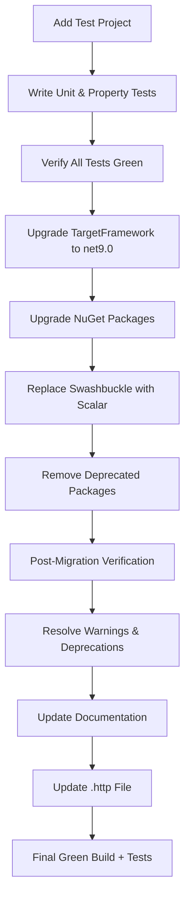

# Design Document — Transactional Outbox Project Update

## Overview

This design covers the modernization of the **Sample.TransactionalOutbox** solution: adding a comprehensive unit test suite as a regression baseline, upgrading the .NET target framework and NuGet packages to their latest stable versions, performing post-migration verification, and rewriting the project documentation.

The work is sequenced deliberately: tests are written and passing **before** any upgrade begins, so regressions introduced by framework or package changes are caught immediately.

### Key Design Decisions

| Decision | Rationale |
|---|---|
| Write tests before upgrading | Establishes a green baseline; any upgrade-induced regression is immediately visible |
| Use xUnit v2 (not v3) | v2 is the mature, widely-adopted stable line; v3 is still stabilizing its ecosystem (FsCheck.Xunit, runner tooling) |
| Use NSubstitute for mocking | Free, MIT-licensed, idiomatic C# API; avoids FluentAssertions v8 licensing concerns |
| Use FsCheck.Xunit for property-based tests | The standard PBT library for .NET with first-class xUnit integration |
| Replace Swashbuckle with Scalar | Swashbuckle is deprecated and no longer maintained; Scalar.AspNetCore is the recommended modern replacement for OpenAPI UI in .NET 9+ |
| Remove Microsoft.AspNetCore.Http.Abstractions | This package is deprecated since ASP.NET Core 3.0; the types are included in the shared framework |
| Keep Newtonsoft.Json | The project relies on `TypeNameHandling` for polymorphic domain event serialization, which System.Text.Json does not support equivalently |

## Architecture

The solution retains its existing three-layer architecture. The update adds test projects under a dedicated `test/` folder (one per source project) and replaces the deprecated Swagger package.

```
src/
├── Sample.TransactionalOutbox.sln
├── Sample.TransactionalOutbox/              # API layer
├── Sample.TransactionalOutbox.Domain/       # Domain layer
└── Sample.TransactionalOutbox.Persistence/  # Persistence layer

test/
├── Sample.TransactionalOutbox.Domain.Tests/       # Unit + property tests for Domain layer
├── Sample.TransactionalOutbox.Persistence.Tests/  # Integration tests for Persistence layer
└── Sample.TransactionalOutbox.Tests/              # Unit tests for API layer (Job)
```

### Layer Dependencies (updated)

```
Domain.Tests → Domain
Persistence.Tests → Persistence, Domain
Tests (API) → API, Domain, Persistence
API → Domain, Persistence
Persistence → Domain
Domain → (MediatR NuGet only)
```

### Upgrade Flow



## Code Style Conventions

All new code (including test projects) must follow the existing project conventions to maintain consistency.

| Convention | Example from project |
|---|---|
| **File-scoped namespaces** | `namespace Sample.TransactionalOutbox.Domain.Order;` |
| **Implicit usings enabled** | No explicit `using System;` etc. |
| **Nullable reference types enabled** | Project-wide `<Nullable>enable</Nullable>` |
| **Private constructors + static `Create` factory** | `private OrderEntity() { }` / `public static OrderEntity Create(...)` |
| **`sealed` on classes that shouldn't be inherited** | `public sealed class OrderDomainEventInterceptor` |
| **`internal sealed` for handlers** | `internal sealed class OrderConfirmedEventHandler` |
| **`internal` for repository implementations** | `internal class OrderRepository` |
| **Properties with `private set`** | `public Guid Id { get; private set; }` |
| **Fields prefixed with `_`** | `private readonly ShopDbContext _context;` |
| **Constructor injection (no primary constructors)** | Explicit constructor with field assignments |
| **`var` for local variables** | `var order = new OrderEntity { ... };` |
| **Single-line `if` without braces for simple guards** | `if (Confirmed) throw new InvalidOperationException(...)` |
| **LINQ fluent syntax** | `.Where(...).Select(...).ToList()` |
| **`record` for domain events** | `public record OrderConfirmed(Guid productId) : IDomainEvent;` |
| **String interpolation with `$`** | `$"Invalid {nameof(description)}"` |
| **`async`/`await` throughout** | All async methods use `async Task` |
| **No `this.` qualifier** | Fields accessed directly via `_fieldName` |

### Test Code Style

Test projects must additionally follow:

| Convention | Detail |
|---|---|
| **Test class naming** | `{ClassUnderTest}Tests` (e.g., `OrderEntityTests`) |
| **Test method naming** | `MethodName_Scenario_ExpectedResult` (e.g., `Create_WithValidInputs_ReturnsUnconfirmedOrder`) |
| **Property test naming** | `Property{N}_{Description}` (e.g., `Property3_CreateInvariant_NewOrdersAreUnconfirmed`) |
| **Arrange-Act-Assert pattern** | Clearly separated sections with comments where helpful |
| **One assertion concept per test** | Each test verifies a single behavior |
| **`[Fact]` for unit tests** | Standard xUnit attribute |
| **`[Property]` for PBT tests** | FsCheck.Xunit attribute with `MaxTest = 100` |

## Components and Interfaces

### Test Project Structure

```
test/
├── Sample.TransactionalOutbox.Domain.Tests/
│   ├── DomainEventManagerTests.cs            # Unit + property tests
│   ├── OrderEntityTests.cs                   # Unit + property tests
│   ├── ProductEntityTests.cs                 # Unit + property tests
│   ├── Generators/
│   │   └── DomainGenerators.cs               # FsCheck Arbitrary generators for domain types
│   └── Sample.TransactionalOutbox.Domain.Tests.csproj
│
├── Sample.TransactionalOutbox.Persistence.Tests/
│   ├── OrderDomainEventInterceptorTests.cs   # Integration tests with InMemory DB
│   └── Sample.TransactionalOutbox.Persistence.Tests.csproj
│
└── Sample.TransactionalOutbox.Tests/
    ├── OutboxMessageProcessorJobTests.cs      # Unit tests with mocked dependencies
    └── Sample.TransactionalOutbox.Tests.csproj
```

### Test Project Dependencies

**Sample.TransactionalOutbox.Domain.Tests:**

| Package | Purpose |
|---|---|
| xunit | Test framework |
| xunit.runner.visualstudio | VS/dotnet test runner |
| Microsoft.NET.Test.Sdk | Test host |
| FsCheck.Xunit | Property-based testing with xUnit integration |
| FluentAssertions (v7.x) | Assertion library (Apache 2.0 licensed) |

Project reference: `Sample.TransactionalOutbox.Domain`

**Sample.TransactionalOutbox.Persistence.Tests:**

| Package | Purpose |
|---|---|
| xunit | Test framework |
| xunit.runner.visualstudio | VS/dotnet test runner |
| Microsoft.NET.Test.Sdk | Test host |
| FsCheck.Xunit | Property-based testing with xUnit integration |
| FluentAssertions (v7.x) | Assertion library (Apache 2.0 licensed) |
| Microsoft.EntityFrameworkCore.InMemory | In-memory DB for interceptor tests |

Project references: `Sample.TransactionalOutbox.Persistence`, `Sample.TransactionalOutbox.Domain`

**Sample.TransactionalOutbox.Tests:**

| Package | Purpose |
|---|---|
| xunit | Test framework |
| xunit.runner.visualstudio | VS/dotnet test runner |
| Microsoft.NET.Test.Sdk | Test host |
| NSubstitute | Mocking interfaces (IPublisher, ILogger) |
| FsCheck.Xunit | Property-based testing with xUnit integration |
| FluentAssertions (v7.x) | Assertion library (Apache 2.0 licensed) |
| Microsoft.EntityFrameworkCore.InMemory | In-memory DB for job tests |

Project references: `Sample.TransactionalOutbox`, `Sample.TransactionalOutbox.Domain`, `Sample.TransactionalOutbox.Persistence`

### Swagger → Scalar Migration

**Before (deprecated):**
```csharp
builder.Services.AddSwaggerGen();
// ...
app.UseSwagger();
app.UseSwaggerUI();
```

**After:**
```csharp
builder.Services.AddOpenApi();
// ...
app.MapOpenApi();
app.MapScalarApiReference();
```

The `Swashbuckle.AspNetCore` package is removed. `Microsoft.AspNetCore.OpenApi` (already present) generates the OpenAPI document, and `Scalar.AspNetCore` provides the interactive UI at `/scalar/v1`.

### Deprecated Package Removal

`Microsoft.AspNetCore.Http.Abstractions` (v2.3.0) in the Persistence project is deprecated. The types it provides (`HttpContext`, `IApplicationBuilder`, etc.) are part of the ASP.NET Core shared framework since .NET 3.0. The package reference is simply removed.

## Data Models

No changes to the existing data models. The domain entities (`OrderEntity`, `ProductEntity`, `OutboxMessageEntity`) and their EF Core configurations remain unchanged.

### FsCheck Generator Models

Custom FsCheck `Arbitrary` generators are needed for property-based tests:

```csharp
// Generates valid non-empty, non-whitespace description strings
public static Arbitrary<NonWhiteSpaceString> ArbitraryDescription()

// Generates valid positive quantities for ProductEntity
public static Arbitrary<PositiveInt> ArbitraryQuantity()

// Generates valid OrderConfirmed domain events with random Guids
public static Arbitrary<OrderConfirmed> ArbitraryOrderConfirmed()

// Generates IDomainEvent instances for DomainEventManager tests
public static Arbitrary<IDomainEvent> ArbitraryDomainEvent()
```

## Correctness Properties

*A property is a characteristic or behavior that should hold true across all valid executions of a system — essentially, a formal statement about what the system should do. Properties serve as the bridge between human-readable specifications and machine-verifiable correctness guarantees.*

### Property 1: RaiseEvent/GetEvents round-trip preserves all events

*For any* list of domain events, raising each event via `RaiseEvent` and then calling `GetEvents` should return a collection containing exactly those events in order, with the count equal to the number of events raised.

**Validates: Requirements 2.1, 2.2, 2.4**

### Property 2: ClearEvents empties the event list

*For any* DomainEventManager instance with any number of previously raised events, calling `ClearEvents` followed by `GetEvents` should return an empty collection.

**Validates: Requirements 2.3, 2.5**

### Property 3: OrderEntity.Create invariant — new orders are unconfirmed

*For any* valid product ID (Guid) and valid non-empty description string, calling `OrderEntity.Create` should produce an instance where `Confirmed` is `false`, `ProductId` matches the input, and `Description` matches the input.

**Validates: Requirements 3.1**

### Property 4: OrderEntity.Create rejects invalid descriptions

*For any* string that is null, empty, or composed entirely of whitespace, calling `OrderEntity.Create` should throw an `ArgumentException`.

**Validates: Requirements 3.2**

### Property 5: ConfirmPayment sets Confirmed and raises correct event

*For any* unconfirmed `OrderEntity`, calling `ConfirmPayment` should set `Confirmed` to `true` and add exactly one `OrderConfirmed` event to the event list whose `productId` matches the order's `ProductId`.

**Validates: Requirements 3.3, 3.4**

### Property 6: Double ConfirmPayment throws

*For any* `OrderEntity` that has already been confirmed, calling `ConfirmPayment` a second time should throw an `InvalidOperationException`.

**Validates: Requirements 3.5**

### Property 7: ProductEntity.Create preserves quantity

*For any* positive integer quantity, calling `ProductEntity.Create` should produce an instance where `Quantity` equals the input value.

**Validates: Requirements 4.1**

### Property 8: ProductEntity.Create rejects non-positive quantities

*For any* integer that is zero or negative, calling `ProductEntity.Create` should throw an exception.

**Validates: Requirements 4.2**

### Property 9: HasBeenConfirmed decrement invariance

*For any* product with initial quantity Q (where Q > 0) and any N (where 1 ≤ N ≤ Q), calling `HasBeenConfirmed` exactly N times should result in `Quantity` equal to Q − N.

**Validates: Requirements 4.3, 4.5**

### Property 10: Interceptor creates correct outbox messages

*For any* `OrderEntity` with N domain events (N ≥ 1), when `SaveChangesAsync` is invoked through the `OrderDomainEventInterceptor`, the `DbContext` should contain exactly N new `OutboxMessageEntity` records, each with a `Type` matching the event's type name and a `Content` field that round-trips back to an equivalent event via JSON deserialization.

**Validates: Requirements 5.1, 5.2, 5.3**

### Property 11: Interceptor clears events after persistence

*For any* `OrderEntity` with domain events, after `SaveChangesAsync` completes through the `OrderDomainEventInterceptor`, calling `GetEvents()` on the entity should return an empty collection.

**Validates: Requirements 5.4**

### Property 12: Successful message processing round-trip

*For any* set of valid unprocessed `OutboxMessageEntity` records (with `CompleteTime == null` and valid serialized content), executing the `OutboxMessageProcessorJob` should deserialize and publish each message via `IPublisher`, and then remove all successfully processed messages from the `DomainEvents` table.

**Validates: Requirements 6.1, 6.2**

## Error Handling

### Test Execution Errors

| Scenario | Handling |
|---|---|
| Test project fails to compile | Block all upgrade work until compilation is fixed |
| Tests fail after framework upgrade | Revert upgrade, investigate, fix code or test, retry |
| Tests fail after package upgrade | Revert package, check release notes for breaking changes, adapt code |
| Deprecated package found post-migration | Replace with recommended alternative or remove |
| Vulnerable package found post-migration | Upgrade to patched version or replace |
| Build warnings after migration | Resolve all warnings before considering migration complete |

### Domain Error Handling (existing, verified by tests)

| Scenario | Expected Behavior |
|---|---|
| `OrderEntity.Create` with null/empty/whitespace description | Throws `ArgumentException` |
| `OrderEntity.ConfirmPayment` on already confirmed order | Throws `InvalidOperationException` |
| `ProductEntity.Create` with quantity ≤ 0 | Throws `ArgumentNullException` |
| `ProductEntity.HasBeenConfirmed` with quantity = 0 | Throws `InvalidOperationException` |
| `OutboxMessageProcessorJob` deserialization failure | Sets `Exception` field, sets `CompleteTime`, does not remove message |
| `OutboxMessageProcessorJob` publish failure | Sets `Exception` field, message remains in table |

## Testing Strategy

### Dual Testing Approach

The project uses two complementary testing strategies:

1. **Unit/Example-based tests** — verify specific scenarios, edge cases, and error conditions with concrete inputs
2. **Property-based tests (FsCheck)** — verify universal properties hold across hundreds of randomly generated inputs

### Property-Based Testing Configuration

- **Library**: FsCheck.Xunit (latest stable)
- **Minimum iterations**: 100 per property test (via `MaxTest = 100` on `[Property]` attribute)
- **Tag format**: `// Feature: project-update, Property {N}: {description}`
- **Each correctness property maps to exactly one `[Property]` test method**

### Test Coverage by Requirement

| Requirement | Test Type | Test Project | Test Class |
|---|---|---|---|
| Req 2: DomainEventManager | Property (P1, P2) + Unit | `Domain.Tests` | `DomainEventManagerTests.cs` |
| Req 3: OrderEntity | Property (P3–P6) + Unit | `Domain.Tests` | `OrderEntityTests.cs` |
| Req 4: ProductEntity | Property (P7–P9) + Unit | `Domain.Tests` | `ProductEntityTests.cs` |
| Req 5: Interceptor | Property (P10, P11) + Unit | `Persistence.Tests` | `OrderDomainEventInterceptorTests.cs` |
| Req 6: Processor Job | Property (P12) + Unit | `Tests` (API) | `OutboxMessageProcessorJobTests.cs` |
| Req 7–9: Upgrades | Smoke (build + test pass) | All | `dotnet build` / `dotnet test` |
| Req 10: README | Manual review | — | — |
| Req 11: Swagger/OpenAPI | Manual verification | — | — |
| Req 12: HTTP file | Manual review | — | — |

### Common Test Packages (shared across all test projects)

| Package | Version | Purpose |
|---|---|---|
| xunit | 2.9.3 | Test framework |
| xunit.runner.visualstudio | 2.8.2 | Test runner for `dotnet test` |
| Microsoft.NET.Test.Sdk | 17.12.0 | Test host infrastructure |
| FsCheck.Xunit | 3.1.0 | Property-based testing |
| FluentAssertions | 7.0.0 | Fluent assertion syntax (Apache 2.0 license) |

**Additional packages per project:**

| Package | Version | Used by | Purpose |
|---|---|---|---|
| NSubstitute | 5.3.0 | `Tests` (API) | Mocking IPublisher, ILogger |
| Microsoft.EntityFrameworkCore.InMemory | 9.0.2 | `Persistence.Tests`, `Tests` (API) | In-memory DB for integration tests |

### NuGet Package Upgrade Targets

| Package | Current | Target | Notes |
|---|---|---|---|
| TargetFramework | net9.0 | net9.0 | Already on latest stable LTS-adjacent; .NET 10 is available but net9.0 is current stable for this project |
| MediatR | 12.4.1 | 14.1.0 | Major version bump; no breaking API changes for INotification/IPublisher usage |
| Quartz | 3.13.1 | 3.13.1+ (latest 3.x) | Check for latest 3.x stable |
| Quartz.Extensions.Hosting | 3.13.1 | Match Quartz version | Must stay in sync |
| Newtonsoft.Json | 13.0.3 | 13.0.3 | Already latest stable; 13.0.4 if available |
| Microsoft.EntityFrameworkCore.InMemory | 9.0.2 | 9.0.x (latest patch) | Match framework version |
| Microsoft.AspNetCore.OpenApi | 9.0.2 | 9.0.x (latest patch) | Match framework version |
| Microsoft.Extensions.Logging.Abstractions | 9.0.2 | 9.0.x (latest patch) | Match framework version |
| Swashbuckle.AspNetCore | 7.2.0 | **REMOVE** | Deprecated; replaced by Scalar |
| Scalar.AspNetCore | — | latest stable | **NEW**: OpenAPI UI replacement |
| Microsoft.AspNetCore.Http.Abstractions | 2.3.0 | **REMOVE** | Deprecated; types in shared framework |

### Documentation Deliverables

1. **README.md** — Complete rewrite following MediatRPipelines-inspired structure:
   - Repository title with short introductory paragraph
   - Table of Contents with anchor links
   - Project Structure table
   - Mermaid flowchart diagram (Transactional Outbox pattern flow)
   - API Endpoints table (no screenshots)
   - Key Components overview with links to `docs/` for deep-dives
   - Getting Started (clone, build, run, test flow)
   - Package Versions table
   - Articles section (Medium link) — **at the end** of the document

2. **docs/ folder** — Navigable markdown files for component deep-dives:
   - `docs/domain-event-manager.md` — Detailed explanation of DomainEventManager (RaiseEvent, GetEvents, ClearEvents)
   - `docs/outbox-interceptor.md` — Detailed explanation of OrderDomainEventInterceptor (SaveChanges interception, serialization)
   - `docs/outbox-processor-job.md` — Detailed explanation of OutboxMessageProcessorJob (polling, deserialization, publishing, error handling)
   - Each doc file links back to the main README for navigation
   - Only create docs for components that need deeper explanation beyond what fits in the README overview

3. **assets/ folder** — Remove. Screenshots are no longer used in the documentation.

4. **Sample.TransactionalOutbox.http** — Complete rewrite:
   - `@host` variable for base URL
   - GET /Products with descriptive comments
   - GET /Orders with descriptive comments
   - POST /PurchaseOrder/{id} with example payload and comments
   - Logical flow order: Products → Orders → PurchaseOrder
