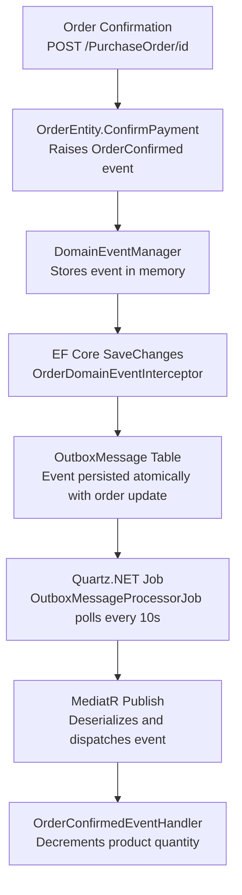

# Transactional Outbox Pattern with EF Core

A sample implementation of the **Transactional Outbox Pattern** using Entity Framework Core in .NET. This project demonstrates how to guarantee atomic persistence of domain events alongside business data changes, avoiding distributed transaction issues in microservices architectures. It uses an in-memory database, Quartz.NET for background job scheduling, and MediatR for in-process event dispatch.

## Table of Contents

- [Project Structure](#project-structure)
- [Pattern Flow](#pattern-flow)
- [API Endpoints](#api-endpoints)
- [Key Components](#key-components)
- [Getting Started](#getting-started)
- [Testing the Flow](#testing-the-flow)
- [Package Versions](#package-versions)
- [Scalar API Reference](#scalar-api-reference)
- [Articles](#articles)

## Project Structure

| Project | Description |
|---|---|
| `Sample.TransactionalOutbox` | API layer — ASP.NET Core Minimal API entry point, endpoint definitions, Quartz.NET job hosting, and DI configuration |
| `Sample.TransactionalOutbox.Domain` | Domain layer — core entities (`OrderEntity`, `ProductEntity`), domain events, `DomainEventManager`, repository interfaces, and MediatR event handlers |
| `Sample.TransactionalOutbox.Persistence` | Persistence layer — EF Core `ShopDbContext`, entity configurations, `OrderDomainEventInterceptor`, repository implementations, and database seeding |
| `Sample.TransactionalOutbox.Domain.Tests` | Domain unit and property-based tests — xUnit + FsCheck tests for `DomainEventManager`, `OrderEntity`, and `ProductEntity` |
| `Sample.TransactionalOutbox.Persistence.Tests` | Persistence integration tests — interceptor tests using EF Core InMemory provider |
| `Sample.TransactionalOutbox.Tests` | API layer tests — `OutboxMessageProcessorJob` unit tests with mocked dependencies |

## Pattern Flow



## API Endpoints

| Method | Endpoint | Description |
|---|---|---|
| `GET` | `/Products` | Returns a list of products with their current quantities |
| `GET` | `/Orders` | Returns a list of all orders and their confirmation status |
| `POST` | `/PurchaseOrder/{id}` | Confirms an order by ID, triggering the outbox pattern flow |

## Key Components

| Component | Description | Details |
|---|---|---|
| **DomainEventManager** | Abstract base class that manages a list of domain events via `RaiseEvent`, `GetEvents`, and `ClearEvents` | [docs/domain-event-manager.md](docs/domain-event-manager.md) |
| **OrderDomainEventInterceptor** | EF Core `SaveChangesInterceptor` that serializes pending domain events into the `OutboxMessage` table within the same transaction | [docs/outbox-interceptor.md](docs/outbox-interceptor.md) |
| **OutboxMessageProcessorJob** | Quartz.NET background job that polls unprocessed outbox messages, deserializes them, and publishes via MediatR | [docs/outbox-processor-job.md](docs/outbox-processor-job.md) |

## Getting Started

1. **Clone the repository**

   ```bash
   git clone <repository-url>
   cd <repository-folder>
   ```

2. **Build the solution**

   ```bash
   dotnet build src/Sample.TransactionalOutbox.sln
   ```

3. **Run the application**

   ```bash
   dotnet run --project src/Sample.TransactionalOutbox
   ```

4. **Run the tests**

   ```bash
   dotnet test src/Sample.TransactionalOutbox.sln
   ```

## Testing the Flow

Follow these steps to observe the Transactional Outbox pattern in action:

1. **Retrieve products** — send a `GET` request to `/Products`. Note the default product quantity (10).

2. **Retrieve orders** — send a `GET` request to `/Orders`. Copy an order ID from the response.

3. **Confirm an order** — send a `POST` request to `/PurchaseOrder/{id}` using the order ID from the previous step. This triggers the domain event flow.

4. **Verify the result** — send another `GET` request to `/Products` and observe that the product quantity has been decremented by one. Send a `GET` request to `/Orders` to confirm the order status is now confirmed.

## Package Versions

| Package | Version | Notes |
|---|---|---|
| .NET | 9.0 | Target framework for all projects |
| MediatR | 14.1.0 | In-process messaging and domain event dispatch |
| Quartz | 3.18.0 | Background job scheduling for outbox processing |
| Quartz.Extensions.Hosting | 3.18.0 | Hosted service integration for Quartz.NET |
| Newtonsoft.Json | 13.0.4 | Domain event serialization with `TypeNameHandling` |
| Microsoft.EntityFrameworkCore.InMemory | 9.0.15 | In-memory database provider for development and testing |
| Microsoft.AspNetCore.OpenApi | 9.0.15 | OpenAPI document generation |
| Microsoft.Extensions.Logging.Abstractions | 10.0.6 | Logging abstractions for the domain layer |
| Scalar.AspNetCore | 2.2.7 | Interactive API reference UI (replaces Swashbuckle) |

## Scalar API Reference

The project uses [Scalar](https://github.com/scalar/scalar) to provide an interactive API reference UI.

- **URL:** [http://localhost:5220/scalar/v1](http://localhost:5220/scalar/v1)
- **Requires:** Development environment (`ASPNETCORE_ENVIRONMENT=Development`)

To launch with the Scalar UI enabled:

```bash
dotnet run --project src/Sample.TransactionalOutbox --environment Development
```

## Articles

- [.NET 8 — Transactional Outbox Pattern With EF Core](https://medium.com/@gabriele.tronchin) by Gabriele Tronchin
