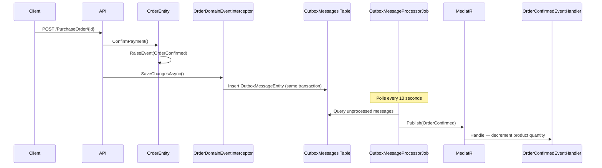
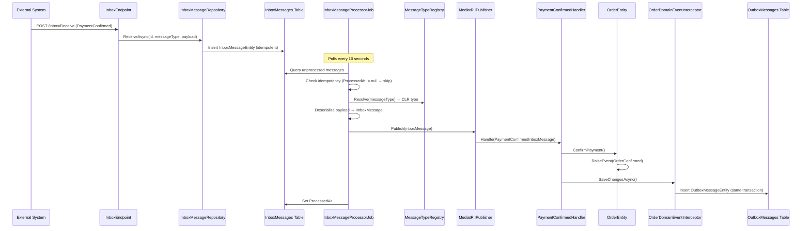
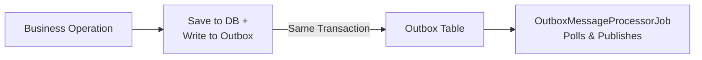
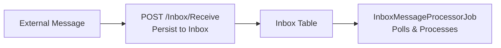

# Marketplace Orders Microservice — Transactional Outbox & Inbox Patterns

A sample .NET marketplace Orders microservice demonstrating both the **Transactional Outbox** and **Transactional Inbox** patterns using C#, Entity Framework Core, MediatR, and Quartz.NET.

The Outbox pattern guarantees that domain events are persisted atomically with business data changes and reliably dispatched to handlers. The Inbox pattern complements it by providing idempotent, reliable processing of incoming external messages.

## Table of Contents

- [Project Structure](#project-structure)
- [Pattern Flows](#pattern-flows)
- [Testing the Flow](#testing-the-flow)
- [API Endpoints](#api-endpoints)
- [Key Components](#key-components)
- [Package Versions](#package-versions)
- [Articles](#articles)

## Project Structure

| Project | Description |
|---|---|
| **Sample.TransactionalOutbox** | API layer with `IEndpoint` classes (auto-discovered), `OutboxMessageProcessorJob`, and `InboxMessageProcessorJob` |
| **Sample.TransactionalOutbox.Domain** | Domain layer with `OrderEntity` (with `OrderStatus` lifecycle), `ProductEntity` (with catalog properties), `InboxMessageEntity`, `OutboxMessageEntity`, `DomainEventManager`, `MessageTypeRegistry`, and inbox message types/handlers |
| **Sample.TransactionalOutbox.Persistence** | Persistence layer with EF Core `DbContext`, repositories (including `InboxMessageRepository`), outbox interceptor, and inbox/outbox configurations |
| **Sample.TransactionalOutbox.Domain.Tests** | Unit and property-based tests for domain logic |
| **Sample.TransactionalOutbox.Persistence.Tests** | Tests for persistence layer |
| **Sample.TransactionalOutbox.Tests** | Integration and cross-cutting tests |

## Pattern Flows

### Transactional Outbox — Events Going Out

The Outbox pattern ensures domain events raised during business operations are persisted atomically with the data change and later dispatched by a background job.

### Transactional Inbox — Messages Coming In

The Inbox pattern provides reliable, idempotent processing of external messages. Messages are first persisted, then processed by a background job that checks for duplicates before executing business logic.

### Conceptual Overview

## Testing the Flow

Use the `Sample.TransactionalOutbox.http` file or Swagger UI (`/swagger`) to explore the API endpoints and observe both the outbox and inbox patterns in action.

## API Endpoints

| Method | Endpoint | Description |
|---|---|---|
| `GET` | `/Products` | Returns a list of all products with their catalog properties and quantities |
| `GET` | `/Products/{id}` | Returns a single product by ID. Returns 404 if not found |
| `GET` | `/Orders` | Returns a list of all orders with their status and details |
| `POST` | `/Orders` | Creates a new order for a given product. Returns 404 if the product is not found |
| `POST` | `/PurchaseOrder/{id}` | Confirms an order by ID, triggering the outbox pattern flow. Returns 404 if not found, 409 if not Pending |
| `POST` | `/Orders/{id}/Cancel` | Cancels a pending order by ID. Returns 404 if not found, 409 if not Pending |
| `POST` | `/Inbox/Receive` | Accepts an external message payload and persists it as an inbox message. Idempotent — returns 200 if the message ID already exists |

### Swagger UI

Swagger UI is available at `/swagger` when running in Development mode.

## Key Components

| Component | Description | Details |
|---|---|---|
| **DomainEventManager** | Abstract base class that manages a list of domain events via `RaiseEvent`, `GetEvents`, and `ClearEvents` | [docs/domain-event-manager.md](docs/domain-event-manager.md) |
| **OrderDomainEventInterceptor** | EF Core `SaveChangesInterceptor` that serializes pending domain events into the `OutboxMessages` table within the same transaction | [docs/outbox-interceptor.md](docs/outbox-interceptor.md) |
| **OutboxMessageProcessorJob** | Quartz.NET background job that polls unprocessed outbox messages, deserializes them, and publishes via MediatR | [docs/outbox-processor-job.md](docs/outbox-processor-job.md) |
| **InboxMessageProcessorJob** | Quartz.NET background job that polls unprocessed inbox messages, resolves types via `MessageTypeRegistry`, deserializes payloads, and publishes via MediatR to dedicated handlers | [docs/inbox-processor-job.md](docs/inbox-processor-job.md) |
| **MessageTypeRegistry** | Singleton that maps `MessageType` strings to CLR types implementing `IInboxMessage`, enabling generic inbox dispatch without hardcoded routing | — |
| **IEndpoint / ServiceExtension** | Interface and assembly-scanning mechanism that auto-discovers endpoint classes (`ProductsEndpoint`, `OrdersEndpoint`, `InboxEndpoint`) and registers them in the DI container | — |
| **IInboxMessageRepository** | Repository interface (Domain) with implementation (Persistence) that handles idempotent inbox message receive and persistence | — |

## Package Versions

| Package | Version | Notes |
|---|---|---|
| .NET | 10.0 | Target framework for all projects |
| MediatR | 12.5.0 | In-process messaging and domain event dispatch (last Apache-2.0 version) |
| Quartz | 3.18.0 | Background job scheduling for outbox and inbox processing |
| Quartz.Extensions.Hosting | 3.18.0 | Hosted service integration for Quartz.NET |
| Newtonsoft.Json | 13.0.4 | Domain event serialization with `TypeNameHandling` |
| Microsoft.EntityFrameworkCore.InMemory | 10.0.5 | In-memory database provider for development and testing |
| Microsoft.AspNetCore.OpenApi | 10.0.5 | OpenAPI document generation |
| Microsoft.Extensions.Logging.Abstractions | 10.0.6 | Logging abstractions for the domain layer |
| Swashbuckle.AspNetCore | 10.1.7 | Swagger UI and OpenAPI documentation |

## Articles

- [.NET 8 — Transactional Outbox Pattern With EF Core](https://medium.com/@gabriele.tronchin) by Gabriele Tronchin
