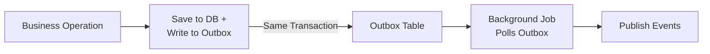
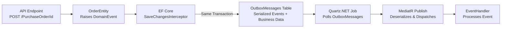

# Transactional Outbox Pattern with EF Core

A sample .NET application demonstrating the Transactional Outbox Pattern with Entity Framework Core.

## Table of Contents

- [Project Structure](#project-structure)
- [Pattern Flow](#pattern-flow)
- [Testing the Flow](#testing-the-flow)
- [API Endpoints](#api-endpoints)
- [Key Components](#key-components)
- [Package Versions](#package-versions)
- [Articles](#articles)

## Project Structure

| Project | Description |
|---|---|
| **Sample.TransactionalOutbox** | API layer with minimal endpoints and Quartz.NET background job |
| **Sample.TransactionalOutbox.Domain** | Domain layer with `OrderEntity`, `ProductEntity`, and `DomainEventManager` |
| **Sample.TransactionalOutbox.Persistence** | Persistence layer with EF Core `DbContext`, repositories, and outbox interceptor |
| **Sample.TransactionalOutbox.Domain.Tests** | Unit and property-based tests for domain logic |
| **Sample.TransactionalOutbox.Persistence.Tests** | Tests for persistence layer |
| **Sample.TransactionalOutbox.Tests** | Integration and cross-cutting tests |

## Pattern Flow

### Conceptual Overview

### Implementation Details

## Testing the Flow

Use the `Sample.TransactionalOutbox.http` file or Swagger UI (`/swagger`) to explore the API endpoints and observe the outbox pattern in action.

## API Endpoints

| Method | Endpoint | Description |
|---|---|---|
| `GET` | `/Products` | Returns a list of products with their current quantities |
| `GET` | `/Orders` | Returns a list of all orders and their confirmation status |
| `POST` | `/PurchaseOrder/{id}` | Confirms an order by ID, triggering the outbox pattern flow |

### Swagger UI

Swagger UI is available at `/swagger` when running in Development mode.

## Key Components

| Component | Description | Details |
|---|---|---|
| **DomainEventManager** | Abstract base class that manages a list of domain events via `RaiseEvent`, `GetEvents`, and `ClearEvents` | [docs/domain-event-manager.md](docs/domain-event-manager.md) |
| **OrderDomainEventInterceptor** | EF Core `SaveChangesInterceptor` that serializes pending domain events into the `OutboxMessage` table within the same transaction | [docs/outbox-interceptor.md](docs/outbox-interceptor.md) |
| **OutboxMessageProcessorJob** | Quartz.NET background job that polls unprocessed outbox messages, deserializes them, and publishes via MediatR | [docs/outbox-processor-job.md](docs/outbox-processor-job.md) |

## Package Versions

| Package | Version | Notes |
|---|---|---|
| .NET | 10.0 | Target framework for all projects |
| MediatR | 14.1.0 | In-process messaging and domain event dispatch |
| Quartz | 3.18.0 | Background job scheduling for outbox processing |
| Quartz.Extensions.Hosting | 3.18.0 | Hosted service integration for Quartz.NET |
| Newtonsoft.Json | 13.0.4 | Domain event serialization with `TypeNameHandling` |
| Microsoft.EntityFrameworkCore.InMemory | 10.0.5 | In-memory database provider for development and testing |
| Microsoft.AspNetCore.OpenApi | 10.0.5 | OpenAPI document generation |
| Microsoft.Extensions.Logging.Abstractions | 10.0.6 | Logging abstractions for the domain layer |
| Swashbuckle.AspNetCore | 10.1.7 | Swagger UI and OpenAPI documentation |

## Articles

- [.NET 8 — Transactional Outbox Pattern With EF Core](https://medium.com/@gabriele.tronchin) by Gabriele Tronchin
